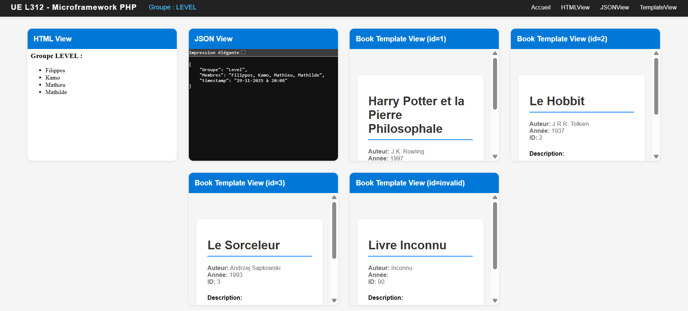

# UE L312 - POO : travail du groupe LEVEL

## Membres du groupe

| Etudiant.e  |   Alias    |
| :---------: | :--------: |
| Mathilde C. | Clouddy23  |
|   Kamo G.   | Spaghette5 |
| Mathieu L.  |  mathleys  |
| Filippos K. |  filkat34  |

## Objectifs

- [x] Mobiliser ses connaissances en POO pour finaliser un projet de Micro-Framework codé en PHP
- [x] Savoir utiliser le client git et la plateforme Github en vue de collaborer au sein d'une équipe de développement.

## Principe général de collaboration

### Répartition du travail

Deux membres de l'équipe travaillent sur l'implémentation du _Router_ et deux autres sur l'implémentation du _Renderer_ et des différentes _Views_.

|  Router  | Renderer/Views |  Tests   |
| :------: | :------------: | :------: |
| Filippos |      Kamo      | Filippos |
| Mathilde |    Mathieu     |          |

### Procédure à suivre

Plusieurs issues ont été identifiées en fonction des classes et des fonctions du framework à implémenter :

1. Chaque membre de l'équipe s'assigne une issue en fonction de son choix dans la répartition du travail (Router/Renderer).
2. Il crée une branche sur laquelle il travaille sur l'issue choisie en lui donnant un nom correspondant à ce qu'il implémente. Exemples : `feature/BaseView/classTemplateView`, `feature/TwigRenderer/fnrender`
3. Une fois son travail fini, il fait une demande de tirage et dans la desceription, ne pas oublier de lier la demande à une issue en mettant "Fixes #[numéro de l'issue concernée]" (par exemple : "Fixes #11"). Github se chargera de fermer l'issue en question une fois la fusion de la demande faite.

Une fois une issue traitée, on s'en assigne une autre et le processus recommence jusqu'à ce qu'il y en ait plus.

### Calendrier des _code reviews_

Chaque membre de l'équipe relit au fil de l'eau les demandes de tirage des autres et commente, fait des suggestions en attendant les code reviews.

En plus des réunions intermédiaires et des échanges dans les chats du groupe, deux réunions sont fixées :

| Code Review n. | Date  |                                                                          Objectif                                                                          |
| :------------: | :---: | :--------------------------------------------------------------------------------------------------------------------------------------------------------: |
|       1        | 19/11 | Présentation du travail effectué par chacun, harmonisation de la façon de concevoir le fonctionnement du framework, première fusion de branches terminées. |
|       2        | 28/11 |                     Relecture et fusion des dernières branches, tests manuels et unitaires (PhP Unit), dépôt du lien Github sur Moodle                     |

### Tests fonctionnels manuels (méthode GET)

Puisque le projet, demandait avant tout de coder des views, on a focalisé nos tests manuels sur le rendering et le routage.

Un dossier de tests a été créé avec différentes views (tests/views) et, à la racine du projet, un fichier index.php qui crée les instances du routeur et du rendereur, enregistre les routes et les sert.

Pour tester le bon fonctionnement, il faut se rendre à la racine du projet et lancer le serveur PHP intégré avec `php -S localhost:8000`

La page d'accueil devrait afficher une templateView avec une liste de cartes de toutes les views de test implementées. Il est possible aussi de cliquer sur les liens de la navigation pour tester que le routage s'effectue correctement.

Sinon, il est possible aussi de :

Tester d'abord le bon fonctionnement de la _HTMLView_ en se rendant sur `http://localhost:8000/html`

Tester ensuite le bon fonctionnement de la _JSONView_ en se rendant sur `http://localhost:8000/json`

Tester pour finir le bon fonctionnement de la _TemplateView_ et des liens dynamiques (book/1, book/2, book/3) en se rendant sur `http://localhost:8000/book/1`

