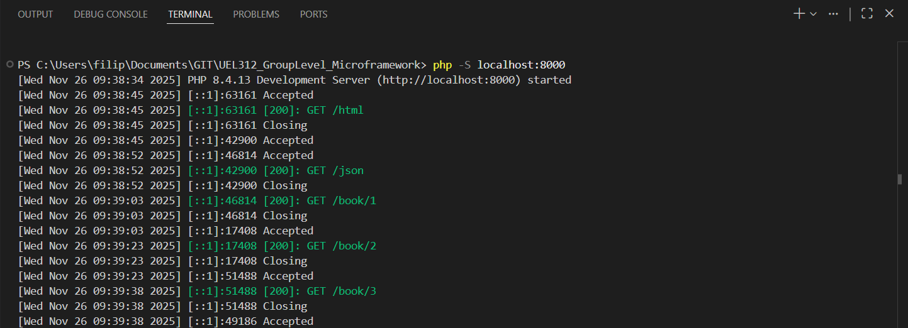
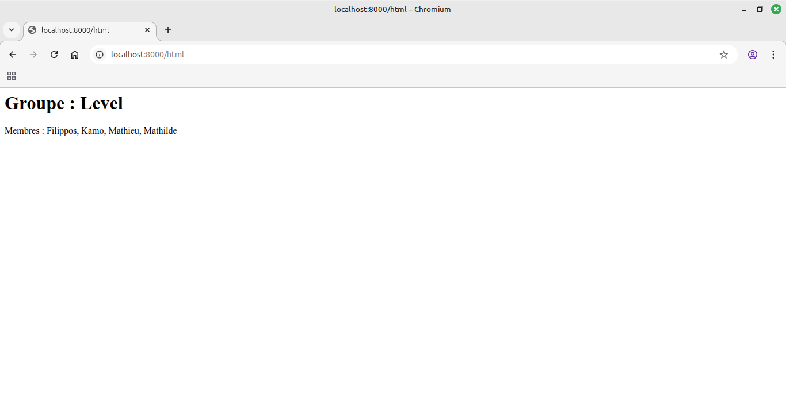
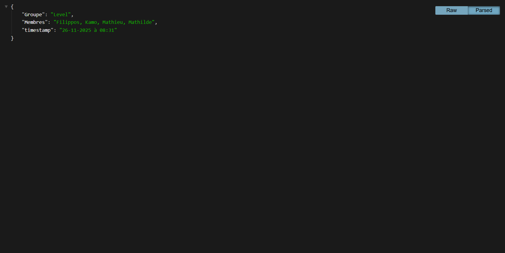
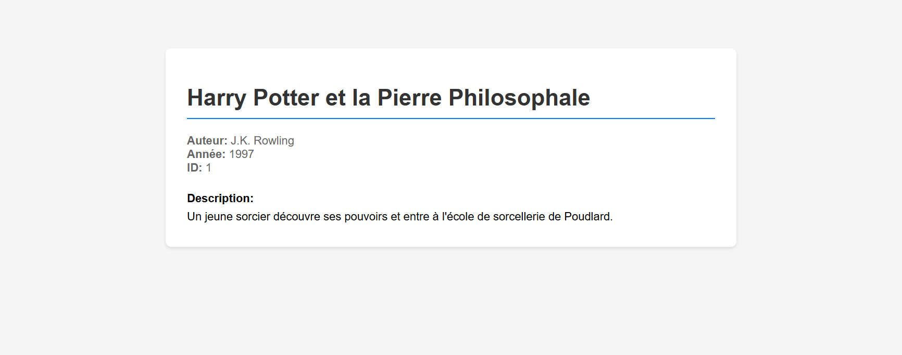

# UE L312 - POO : travail du groupe LEVEL 

## Membres du groupe

| Etudiant.e  |   Alias    |
| :---------: | :--------: |
| Mathilde C. | Clouddy23  |
|   Kamo G.   | Spaghette5 |
| Mathieu L.  |  mathleys  | 
| Filippos K. |  filkat34  | 

## Objectifs

- [x] Mobiliser ses connaissances en POO pour finaliser un projet de Micro-Framework codé en PHP
- [x] Savoir utiliser le client git et la plateforme Github en vue de collaborer au sein d'une équipe de développement.

## Principe général de collaboration

### Répartition du travail

Deux membres de l'équipe travaillent sur l'implémentation du _Router_ et deux autres sur l'implémentation du _Renderer_.

|   Router    |   Renderer  |
| :---------: | :--------:  |
| Filippos    | Kamo        |
| Mathilde    | Mathieu     |

### Principe général de fonctionnement

Plusieurs issues ont été identifiées en fonction des classes et des fonctions du framework à implémenter :

1. Chaque membre de l'équipe s'assigne une issue en fonction de son choix dans la répartition du travail (Router/Renderer).
2. Il crée une branche sur laquelle il travaille sur l'issue choisie en lui donnant un nom correspondant à ce qu'il implémente. Exemples : ```feature/BaseView/classTemplateView```, ```feature/TwigRenderer/fnrender```
3. Une fois son travail fini, il fait une demande de tirage.

Une fois une issue traitée, on s'en assigne une autre et le processus recommence jusqu'à ce qu'il y en ait plus.

### Code review de finalisation

Chaque membre de l'équipe relit au fil de l'eau les demandes de tirage des autres et commente, fait des suggestions.

Une _code review_ doit être prévue suffisamment en avance par rapport à la date de rendu (au moins J-2) afin qu'on puisse fusionner les branches et faire des tests.

### Tests fonctionnels manuels (méthode GET)

Se rendre à la racine du projet et lancer le serveur PHP intégré avec ``php -S localhost:8000``



Tester d'abord le bon fonctionnement de la 



Tester ensuite le bon fonctionnement de la 



Tester pour finir le bon fonctionnement de la  et des liens dynamiques (book/1, book/2, book/3)

